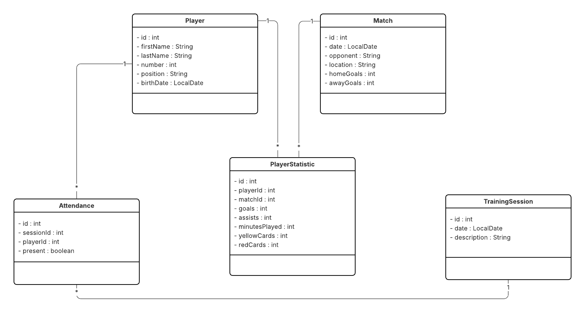

# Management echipa de fotbal
### Lupu Eugen-Petrișor

## Descriere
Aplicatie desktop folosita pentru managementul unei echipa de fotbal, folosita de antrenor pentru:
* administrare jucatori
* programare meciuri si inregistrare rezultate
* inregistrare statistici (goluri, cartonase rosii/galbene, minute jucate)
* gestionarea prezentei la antrenamente
* generare rapoarte si grafice pentru analiza

## Lisa principalelor functionalitati
* Gestionare jucatori: adaugare, stergere, editare, listare
* Gestionare meciuri: creare meci, editare, introducere scor
* Inregistrare statistici jucatori pentru fiecare meci
    - goluri
    - pase de gol
    - minute jucate
    - dueluri castigate, pase reusite, mingi salvate (in functie de pozitia din teren a jucatorului)
* Prezenta antrenamente: creare sesiune antrenament, marcare prezenta pentru fiecare jucator
* Rapoarte si statistici: top golgheteri, procent prezenta, posesia medie
* Vizualizari grafice: grafice de evolutie pentru goluri/minute

## Arhitectura
### Clase

### Baza de date

Tabela players:  
id (PK, INT, AUTO)  
first_name (VARCHAR)  
last_name (VARCHAR)  
number (INT)  
position (VARCHAR)  
birth_date (DATE)  

Tabela matches:  
id (PK)  
match_date (DATE)  
opponent (VARCHAR)  
location (VARCHAR)  
home_goals (INT)  
away_goals (INT)  

Tabela player_statistics:  
id (PK)  
player_id (FK -> players.id)  
match_id (FK -> matches.id)  
goals (INT)  
assists (INT)  
minutes_played (INT)  
yellow_cards (INT)  
red_cards (INT)  

Tabela training_sessions:  
id (PK)  
session_date (DATE)  
description (TEXT)  

Tabela attendance:  
id (PK)  
session_id (FK -> training_sessions.id)  
player_id (FK -> players.id)  
present (BOOLEAN)  

Relatii:  
players (1) — (N) player_statistics  
matches (1) — (N) player_statistics  
training_sessions (1) — (N) attendance  
players (1) — (N) attendance  

## Use cases
- Gestionarea jucatorilor - antrenorul poate adauga/edita/sterge jucatori  
- Planificarea unui meci - antrenorul poate programa un meci: adversar, data/ora, locatie  
- Inregistrarea unui rezultat - antrenorul introduce scorul si statisticile jucatorilor dupa meci
- Antrenament - antrenorul poate organiza o sesiune de antrenament si marcheaza prezenta (+ randamentul jucatorilor eventual)
- Vizualizare rapoarte si statistici - antrenorul poate genera rapoarte (top golgheteri, top marcatori decisivi, prezenta la antrenament)

### Resurse
Markdown Guide, [Online] Available: https://www.markdownguide.org/basic-syntax/ [accesed: Mar 14, 1706]
